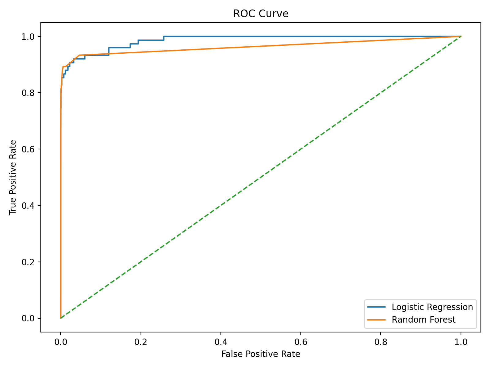
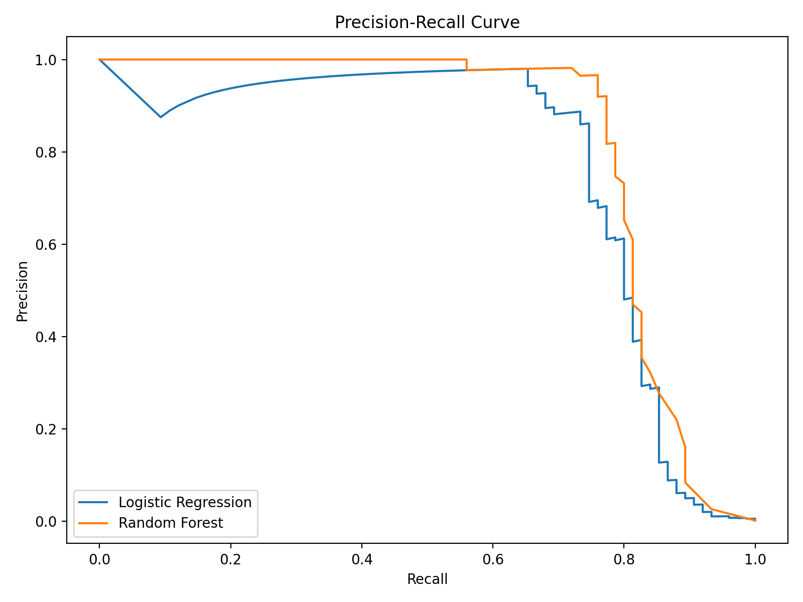
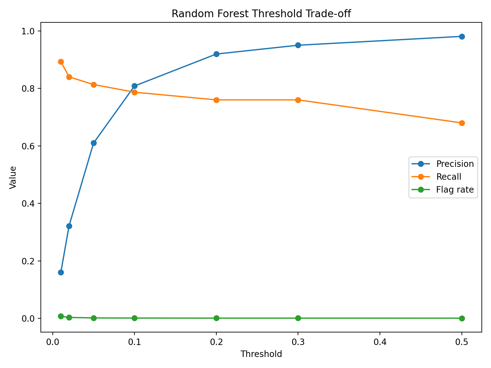

# Credit Card Fraud Detection Pipeline

## Overview

This project implements an end-to-end machine learning pipeline for detecting fraudulent credit card transactions — from raw data ingestion through to inference on new transactions.

The pipeline ingests raw transaction data into DuckDB, engineers behavioural features using rolling statistics, trains and compares classification models, and exposes a predict step that scores new transactions and flags suspected fraud. Model selection and threshold tuning are framed around operational constraints: balancing fraud catch rate against investigation workload.

---

## Dataset

The dataset contains anonymised European credit card transactions with PCA-transformed features (V1-V28), transaction amount, and a binary fraud label. Fraudulent transactions account for 0.172% of all transactions, making this a highly imbalanced classification problem.

Due to this imbalance, evaluation focuses on precision-recall metrics rather than accuracy. ROC-AUC is reported for completeness but PR-AUC is the primary performance indicator.

The raw dataset is not included due to licensing constraints.

**Dataset source:** https://www.kaggle.com/datasets/mlg-ulb/creditcardfraud

After downloading, place the file at:

    data/raw/creditcard.csv

A held-out sample of test transactions (`data/raw/sample_transactions.csv`) is included for running the predict step without downloading the full dataset.

---

## Pipeline

The pipeline is modular and CLI-driven, with each stage independently runnable.

### 1. Data ingestion
Raw transaction data is loaded from CSV and written to a DuckDB table. Input validation checks for required columns, null values, and invalid class labels before committing.

### 2. Feature engineering
Behavioural features are generated using rolling window statistics over the preceding 1,000 transactions:

- Rolling mean transaction amount
- Rolling standard deviation
- Transaction z-score (how unusual is this amount relative to recent history)
- Log-transformed amount

Features are computed in DuckDB using window functions, keeping transformation logic close to the data.

### 3. Model training
Two models are trained on a chronological 80/20 train/test split — preserving temporal order to avoid lookahead leakage:

**Logistic Regression** — linear baseline with class weighting to handle imbalance.

**Random Forest** — non-linear ensemble with 300 estimators and class weighting. Captures interactions between PCA components that the linear model cannot.

### 4. Model evaluation
Models are evaluated on the held-out test set using ROC-AUC and PR-AUC. Classification thresholds are swept from 0.01 to 0.50 to characterise the precision/recall tradeoff across operating points.

Trained models are persisted to `artifacts/models/` using joblib for use in the inference step.

### 5. Inference
The predict step loads a saved model and scores new transactions end-to-end — ingesting a CSV, running feature engineering, and outputting fraud probabilities and flags to `artifacts/predictions.csv`.

The Random Forest model is used for inference at a default threshold of 0.10, selected at the precision/recall crossover point (~0.80 precision, ~0.79 recall). Applied to the held-out test set, this flags 73 transactions out of 56,961 (0.13%), compared to a true fraud rate of 0.172% — a deliberate tradeoff accepting some missed fraud in exchange for a manageable investigation queue.

> Note: The sample transactions used for inference are drawn from the held-out test set of the same Kaggle dataset. In production the model would be evaluated against genuinely new transaction data; performance on this demo may be optimistic due to distributional similarity with training data.

---

## Results

| Model | ROC-AUC | PR-AUC |
|-------|---------|--------|
| Logistic Regression | ~0.986 | ~0.762 |
| Random Forest | ~0.964 | ~0.820 |

The Random Forest model achieves stronger PR-AUC despite a lower ROC-AUC, reflecting better performance at the high-precision operating points most relevant to fraud detection. The V1-V28 PCA features carry the majority of predictive signal; the engineered rolling features contribute at the margin.

---

## Operational Trade-offs

Fraud detection systems must balance two competing objectives:

**Recall** — catching as many fraudulent transactions as possible.

**Precision** — avoiding unnecessary investigation of legitimate transactions.

Lower thresholds increase recall but generate more alerts. Higher thresholds improve precision but risk missing genuine fraud. In most fraud detection contexts, missed fraud carries higher cost than a false positive — chargebacks, customer harm, and regulatory exposure — which biases the operating point toward lower thresholds.

The threshold sweep artifacts allow this balance to be adjusted to match operational capacity.

---

## Evaluation

### ROC Curve


### Precision–Recall Curve


### Random Forest Threshold Trade-off


---

## Running the Pipeline

### Setup

1. Clone the repository and create a virtual environment:

        python -m venv .venv
        source .venv/bin/activate
        pip install -e .

2. Create a `.env` file in the project root:

        FRAUD_CSV_PATH=data/raw/creditcard.csv
        FRAUD_DB_PATH=data/interim/fraud.duckdb

### Full pipeline

        python -m fraud_pipeline.run ingest
        python -m fraud_pipeline.run features
        python -m fraud_pipeline.run model
        python -m fraud_pipeline.run predict

### Inference only (no dataset download required)

The sample transactions file is included in the repository. After running `model` to train and save the model:

        python -m fraud_pipeline.run predict

Predictions are saved to `artifacts/predictions.csv`.

---

## Project Structure

```
fraud-detect
├── artifacts/                  # model outputs and experiment results
│   ├── models/                 # saved model files (joblib)
│   │   ├── random_forest.joblib
│   │   └── logistic_regression.joblib
│   ├── model_metrics.csv
│   ├── threshold_results.csv
│   └── predictions.csv
├── data/
│   ├── raw/
│   │   ├── creditcard.csv      # full dataset (not committed)
│   │   └── sample_transactions.csv  # held-out test slice for inference demo
│   └── interim/                # DuckDB feature store
├── report/
│   └── figures/                # evaluation plots
└── src/
    └── fraud_pipeline/
        ├── ingest/
        │   └── ingest.py
        ├── model/
        │   ├── train.py
        │   └── predict.py
        ├── transform/
        │   └── features.py
        ├── config.py
        ├── validate.py
        └── run.py              # CLI entry point
```